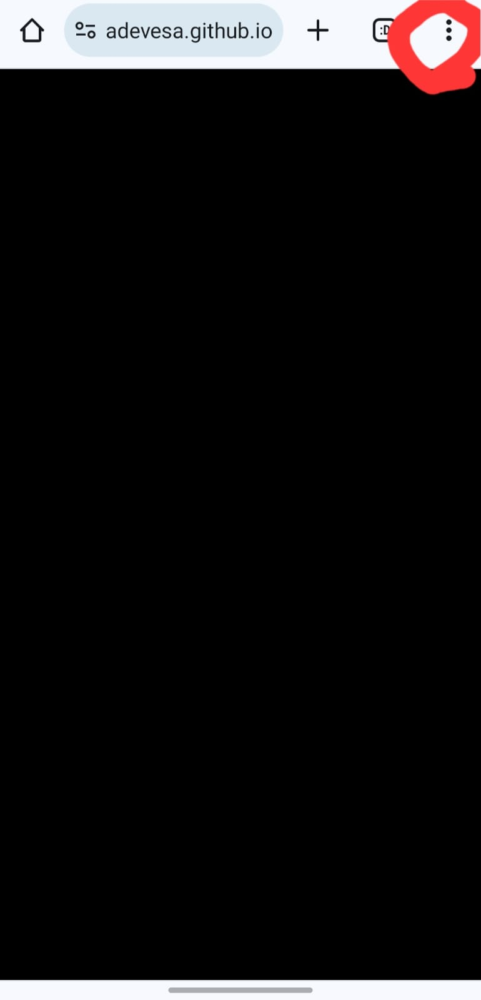

# Sleep Baby Sleep 💤😴

<table>
<tr>
<td>
This repository serves the purpose of providing soothing noises for babies, to aid in their sleep or to help them calm down.
</td>
</tr>
</table>

### 💻You can access it [here](adevesa.github.io/sleep-baby-sleep)📲

## How to use it

Single touch for play/pause, swipe left for options, swipe right for close options.

## Features

- Mobile First
- Various background noises (thanks to [brarcher](https://github.com/brarcher/baby-sleep-sounds))
- Service worker to cache and use offline mode (useful for airplane trips, saving data plans)
- Ad-free and tracker-free

## Screenshots

## Add to your homescreen!

Open your Chrome app, select options (three points options)

Press *Add to Home Screen* 

